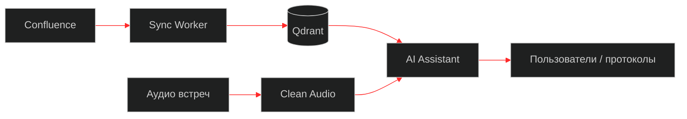

<!--
Design system (red/black cyberpunk):
  palette: #000000 · #141414 · #c41212 · #ff2a2a
  formats:
    banner  1280×400  hero
    about   960×720   4:3 panel
    cards   640×640   1:1 trio
    strip   1280×40   separator (transparent PNG)
    divider 1280×24   thin SVG line (no background)
    footer  1280×220  closing
-->

<div align="center">
  
</div>

<br />

<div align="center">

# Артём Тюкин
### Fullstack / Python-инженер · AI в проде

Собираю сервисы, которыми реально пользуются:  
`AI-платформы` · `RAG` · `агенты` · `REST/webhooks` · `корпоративные боты`

[](https://github.com/artyom-ai-dev/portfolio)
[](https://github.com/artyom-ai-dev/portfolio)
[](https://github.com/artyom-ai-dev/portfolio)
[](https://github.com/artyom-ai-dev/portfolio)

<p>
  <a href="mailto:tyukin69@bk.ru">Почта</a> ·
  <a href="https://github.com/artyom-ai-dev/portfolio">Кейсы</a> ·
  гибрид / удалёнка · <b>Открыт к предложениям</b>
</p>

</div>


## Начни отсюда

| Открой первым | Зачем |
|------------|-----|
| **[portfolio](https://github.com/artyom-ai-dev/portfolio)** | Публичные кейсы: архитектура, потоки, результат — без приватного кода |
| **[01 · AI-платформа](https://github.com/artyom-ai-dev/portfolio/blob/main/cases/01-ai-platform.md)** | Главный кейс: RAG + агенты + пайплайн встреч |
| **[02 · Мессенджер ↔ трекер](https://github.com/artyom-ai-dev/portfolio/blob/main/cases/02-messenger-tracker-sync.md)** | Прод: webhooks и двусторонняя синхронизация |

Рабочие репозитории **приватные** (корпоративные данные). Разбор кода — на собеседовании.


## Обо мне

<table>
<tr>
<td width="58%" valign="top">

Инженер-программист / инженер-разработчик в **Уральском турбинном заводе (УЦТ)**.

Делаю **продакшен-системы**, а не демо в ноутбуках:  
API → интеграции → Docker → пользователи.

Сильная сторона — стык **инженерии, AI и корпоративных систем**.

Ищу роли: **Fullstack / Python**, **инженер-программист**, **прикладной data scientist**.  
Не трек чистого DevOps и не РП.

</td>
<td width="42%" valign="top">
  
</td>
</tr>
</table>


## Фокус

<table>
  <tr>
    <td align="center" width="33%">
      <br/>
      <b>AI-платформа</b><br/>
      <sub>агенты · RAG · LLM · STT</sub>
    </td>
    <td align="center" width="33%">
      <br/>
      <b>Интеграции</b><br/>
      <sub>REST · webhooks · Jira · LDAP</sub>
    </td>
    <td align="center" width="33%">
      <br/>
      <b>Данные / автоматизация</b><br/>
      <sub>pandas · Excel · matching</sub>
    </td>
  </tr>
</table>


## Главный кейс

**Корпоративный AI-контур:** база знаний + агенты + встречи.



Confluence → векторный поиск → агент с tools; встречи: очистка аудио → STT → протокол.  
Подробнее → [кейс 01](https://github.com/artyom-ai-dev/portfolio/blob/main/cases/01-ai-platform.md) · все кейсы → [portfolio](https://github.com/artyom-ai-dev/portfolio)


## Проекты

### AI-платформа
| | Проект | Что внутри | Кейс |
|:-:|--------|------------|------|
| 01 | **AI Assistant** | Агенты, tool-calling, RAG, протоколы встреч, Ollama/GigaChat, Qdrant | [01](https://github.com/artyom-ai-dev/portfolio/blob/main/cases/01-ai-platform.md) |
| 02 | **Confluence Sync Worker** | Confluence → чанкинг → TEI/e5 → Qdrant | [01](https://github.com/artyom-ai-dev/portfolio/blob/main/cases/01-ai-platform.md) |
| 03 | **Clean Audio Service** | DeepFilterNet3 + ffmpeg → вход для STT | [01](https://github.com/artyom-ai-dev/portfolio/blob/main/cases/01-ai-platform.md) |
| 04 | **Peregovornaya** | Запись встреч на Pi → выгрузка → AI-протокол | [01](https://github.com/artyom-ai-dev/portfolio/blob/main/cases/01-ai-platform.md) |

### Интеграции и автоматизация
| | Проект | Что внутри | Кейс |
|:-:|--------|------------|------|
| 05 | **jira-to-servicedesk** | Jira ↔ Express: чаты, файлы, CSAT, webhooks | [02](https://github.com/artyom-ai-dev/portfolio/blob/main/cases/02-messenger-tracker-sync.md) |
| 06 | **bot_jira** | Дайджесты SLA Jira/ServiceDesk в каналы | [02](https://github.com/artyom-ai-dev/portfolio/blob/main/cases/02-messenger-tracker-sync.md) |
| 07 | **pass_bot** | Сброс пароля AD из мессенджера (LDAPS) | [03](https://github.com/artyom-ai-dev/portfolio/blob/main/cases/03-identity-self-service.md) |
| 08 | **usercreatealertbot** | Алерты по жизненному циклу учёток | [03](https://github.com/artyom-ai-dev/portfolio/blob/main/cases/03-identity-self-service.md) |
| 09 | **YGO_WEB** | Flask + LDAP + Excel + email | [04](https://github.com/artyom-ai-dev/portfolio/blob/main/cases/04-excel-web-automation.md) |

> Рабочие репозитории **приватные**. Разбор кода — на собеседовании.  
> Публичные описания — в **[portfolio](https://github.com/artyom-ai-dev/portfolio)**.

---

## Стек

<p align="center">
  
</p>

```text
Backend        Python · FastAPI · Flask · Docker · REST · SQL
AI / ML        LLM · RAG · Agents · LangChain · Qdrant · PyTorch · STT
Интеграции     Webhooks · Jira · eXpress · LDAP/AD · Confluence
Данные         pandas · openpyxl · Excel-пайплайны
```

## Как работаю

- От «есть боль» до **сервиса в проде**
- Границы систем: webhooks, грязные данные, несколько источников истины
- Документирую API и пайплайны так, чтобы их можно было сопровождать
- AI — только если даёт реальную пользу процессу


