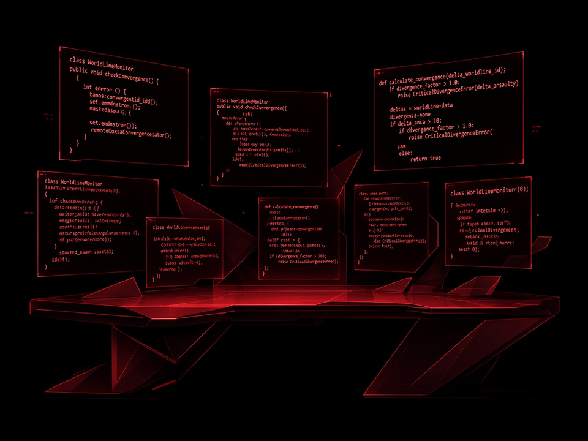
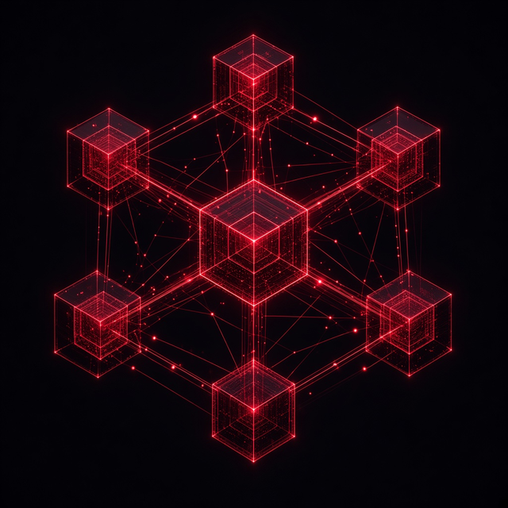
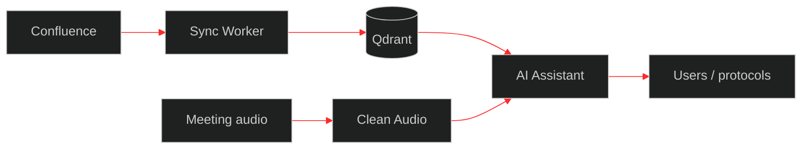

<!--
Design system (red/black cyberpunk):
  palette: #000000 · #141414 · #c41212 · #ff2a2a
  formats:
    banner  1280×400  hero
    about   960×720   4:3 panel
    cards   640×640   1:1 trio
    strip   1280×120  separator
    footer  1280×220  closing
-->

<div align="center">
  
</div>

<br />

<div align="center">

# Artem Tyukin
### Fullstack / Python Engineer · AI in production

I build services that people actually use:  
`AI platforms` · `RAG` · `agents` · `REST/webhooks` · `corporate bots`

<small>Артём Тюкин · fullstack / Python · AI-сервисы в проде · Екатеринбург · open to work</small>

[](https://github.com/artyom-ai-dev/portfolio)
[](https://github.com/artyom-ai-dev/portfolio)
[](https://github.com/artyom-ai-dev/portfolio)
[](https://github.com/artyom-ai-dev/portfolio)

<p>
  <a href="mailto:tyukin69@bk.ru">Email</a> ·
  <a href="https://github.com/artyom-ai-dev/portfolio">Case studies</a> ·
  Yekaterinburg · hybrid / remote · <b>Open to work</b>
</p>

</div>


## Start here

| Open first | Why |
|------------|-----|
| **[portfolio](https://github.com/artyom-ai-dev/portfolio)** | Public case studies (architecture, flows, outcomes — no private source) |
| **[01 · AI platform](https://github.com/artyom-ai-dev/portfolio/blob/main/cases/01-ai-platform.md)** | Flagship: RAG + agents + meeting pipeline |
| **[02 · Messenger ↔ tracker](https://github.com/artyom-ai-dev/portfolio/blob/main/cases/02-messenger-tracker-sync.md)** | Production webhooks / two-way sync |

Working repos stay **private** (enterprise data). Code walkthrough available in interview.

---

## About

<table>
<tr>
<td width="58%" valign="top">

Software engineer / developer at **Ural Turbine Works (Digital Transformation unit)**.

I ship **production systems**, not notebook demos:  
API → integrations → Docker → users.

Strength: the intersection of **engineering, AI, and enterprise systems**.

Looking for roles: **Fullstack / Python**, **software engineer**, **applied data scientist**.  
Not DevOps-only and not project-manager tracks.

</td>
<td width="42%" valign="top">
  
</td>
</tr>
</table>

---

## Focus areas

<table>
  <tr>
    <td align="center" width="33%">
      <br/>
      <b>AI platform</b><br/>
      <sub>agents · RAG · LLM · STT</sub>
    </td>
    <td align="center" width="33%">
      <br/>
      <b>Integrations</b><br/>
      <sub>REST · webhooks · Jira · LDAP</sub>
    </td>
    <td align="center" width="33%">
      <br/>
      <b>Data / automation</b><br/>
      <sub>pandas · Excel · matching</sub>
    </td>
  </tr>
</table>

---

## Flagship case

**Enterprise AI contour:** knowledge base + agents + meetings.



Confluence → vector search → agent with tools; meetings: audio cleanup → STT → protocol.  
Details → [case 01](https://github.com/artyom-ai-dev/portfolio/blob/main/cases/01-ai-platform.md) · all cases → [portfolio](https://github.com/artyom-ai-dev/portfolio)


## Projects

### AI platform
| | Project | What's inside | Case |
|:-:|--------|------------|------|
| 01 | **AI Assistant** | Agents, tool-calling, RAG, meeting protocols, Ollama/GigaChat, Qdrant | [01](https://github.com/artyom-ai-dev/portfolio/blob/main/cases/01-ai-platform.md) |
| 02 | **Confluence Sync Worker** | Confluence → chunking → TEI/e5 → Qdrant | [01](https://github.com/artyom-ai-dev/portfolio/blob/main/cases/01-ai-platform.md) |
| 03 | **Clean Audio Service** | DeepFilterNet3 + ffmpeg → STT input | [01](https://github.com/artyom-ai-dev/portfolio/blob/main/cases/01-ai-platform.md) |
| 04 | **Peregovornaya** | Pi meeting recorder → upload → AI protocol | [01](https://github.com/artyom-ai-dev/portfolio/blob/main/cases/01-ai-platform.md) |

### Integrations & automation
| | Project | What's inside | Case |
|:-:|--------|------------|------|
| 05 | **jira-to-servicedesk** | Jira ↔ Express: chats, files, CSAT, webhooks | [02](https://github.com/artyom-ai-dev/portfolio/blob/main/cases/02-messenger-tracker-sync.md) |
| 06 | **bot_jira** | Jira/ServiceDesk SLA digests to channels | [02](https://github.com/artyom-ai-dev/portfolio/blob/main/cases/02-messenger-tracker-sync.md) |
| 07 | **pass_bot** | AD password reset from messenger (LDAPS) | [03](https://github.com/artyom-ai-dev/portfolio/blob/main/cases/03-identity-self-service.md) |
| 08 | **usercreatealertbot** | Alerts on account lifecycle events | [03](https://github.com/artyom-ai-dev/portfolio/blob/main/cases/03-identity-self-service.md) |
| 09 | **YGO_WEB** | Flask + LDAP + Excel + email | [04](https://github.com/artyom-ai-dev/portfolio/blob/main/cases/04-excel-web-automation.md) |

> Working repositories are **private**. Code walkthrough available in interview.  
> Public write-ups are in **[portfolio](https://github.com/artyom-ai-dev/portfolio)**.

---

## Stack

<p align="center">
  
</p>

```text
Backend        Python · FastAPI · Flask · Docker · REST · SQL
AI / ML        LLM · RAG · Agents · LangChain · Qdrant · PyTorch · STT
Integrations   Webhooks · Jira · eXpress · LDAP/AD · Confluence
Data           pandas · openpyxl · Excel pipelines
```

## How I work

- From “there is a pain” to a **service in production**
- System boundaries: webhooks, messy data, multiple sources of truth
- I document APIs and pipelines so they can be maintained
- AI only when it creates real process value


