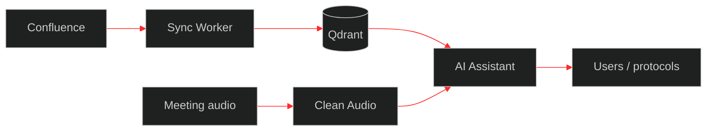

<!--
Design system (red/black cyberpunk):
  palette: #000000 · #141414 · #c41212 · #ff2a2a
  formats:
    banner  1280×400  hero
    about   960×720   4:3 panel
    cards   640×640   1:1 trio
    strip   1280×120  separator
    footer  1280×220  closing
-->

<div align="center">
  
</div>

<br />

<div align="center">

# Artem Tyukin
### Fullstack / Python Engineer · AI in production

Строю сервисы, которые реально работают у людей  
`AI-платформы` · `RAG` · `агенты` · `REST/webhooks` · `корпоративные боты`

[](https://github.com/artyom-ai-dev/portfolio)
[](https://github.com/artyom-ai-dev/portfolio)
[](https://github.com/artyom-ai-dev/portfolio)
[](https://github.com/artyom-ai-dev/portfolio)

<p>
  <a href="mailto:tyukin69@bk.ru">Email</a> ·
  <a href="https://github.com/artyom-ai-dev/portfolio">Case studies</a> ·
  Екатеринбург · гибрид / удалёнка · <b>Open to work</b>
</p>

</div>


## Обо мне

<table>
<tr>
<td width="58%" valign="top">

Инженер-программист / инженер-разработчик в **УЦТ Уральского турбинного завода**.

Делаю не демо в ноутбуке, а **production-контур**:  
API → интеграции → Docker → пользователи.

Сильная сторона — стык **разработки, AI и корпоративных систем**.

Ищу роли: **Fullstack / Python**, **инженер**, **прикладной DS**.  
Не трек DevOps-only и не РП.

</td>
<td width="42%" valign="top">
  
</td>
</tr>
</table>

---

## Направления

<table>
  <tr>
    <td align="center" width="33%">
      <br/>
      <b>AI platform</b><br/>
      <sub>агенты · RAG · LLM · STT</sub>
    </td>
    <td align="center" width="33%">
      <br/>
      <b>Integrations</b><br/>
      <sub>REST · webhooks · Jira · LDAP</sub>
    </td>
    <td align="center" width="33%">
      <br/>
      <b>Data / automation</b><br/>
      <sub>pandas · Excel · сверки</sub>
    </td>
  </tr>
</table>

---

## Главный кейс

**Корпоративный AI-контур:** база знаний + агенты + встречи.



Confluence → векторный поиск → агент с tools; встречи: очистка аудио → STT → протокол.  
Подробнее → [case 01](https://github.com/artyom-ai-dev/portfolio/blob/main/cases/01-ai-platform.md) · все кейсы → [portfolio](https://github.com/artyom-ai-dev/portfolio)


## Проекты

### AI-платформа
| | Проект | Что внутри |
|:-:|--------|------------|
| 01 | **AI Assistant** | Агенты, tool-calling, RAG, протоколы встреч, Ollama/GigaChat, Qdrant |
| 02 | **Confluence Sync Worker** | Confluence → чанкинг → TEI/e5 → Qdrant |
| 03 | **Clean Audio Service** | DeepFilterNet3 + ffmpeg → вход в STT |
| 04 | **Peregovornaya** | Запись встреч на Pi → выгрузка → ИИ-протокол |

### Интеграции и автоматизация
| | Проект | Что внутри |
|:-:|--------|------------|
| 05 | **jira-to-servicedesk** | Jira ↔ Express: чаты, файлы, CSAT, webhooks |
| 06 | **bot_jira** | SLA-дайджесты Jira/ServiceDesk в каналы |
| 07 | **pass_bot** | Смена пароля AD из мессенджера (LDAPS) |
| 08 | **usercreatealertbot** | Алерты по событиям учёток |
| 09 | **YGO_WEB** | Flask + LDAP + Excel + email |

> Рабочие репозитории **приватные**. Код — на собеседовании.  
> Публичные разборы — в **[portfolio](https://github.com/artyom-ai-dev/portfolio)**.

---

## Стек

<p align="center">
  
</p>

```text
Backend        Python · FastAPI · Flask · Docker · REST · SQL
AI / ML        LLM · RAG · Agents · LangChain · Qdrant · PyTorch · STT
Integrations   Webhooks · Jira · eXpress · LDAP/AD · Confluence
Data           pandas · openpyxl · Excel pipelines
```

## Как я работаю

- От «есть боль» до **сервиса в проде**
- Стыки систем: webhooks, грязные данные, несколько источников правды
- Документирую API и пайплайны под сопровождение
- AI — только если даёт пользу процессу

## Образование и языки

- **УрГУПС**, ИСТ (**Искусственный интеллект**), 2026  
- Русский — родной · Английский — **B2**


<div align="center">

📧 **tyukin69@bk.ru** · 📱 +7 (982) 690-26-23  
🌐 [github.com/artyom-ai-dev](https://github.com/artyom-ai-dev) · [portfolio](https://github.com/artyom-ai-dev/portfolio)

**Open to work** · fullstack / Python / applied AI · гибрид или удалённо

</div>
