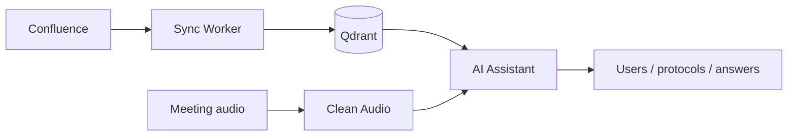

<div align="center">

# Привет, я Артём 👋
### Fullstack / Python Engineer · AI in production

Строю сервисы, которые реально работают у людей:  
**AI-платформы · RAG · агенты · REST/webhooks · корпоративные боты**

[](https://github.com/artyom-ai-dev/portfolio)
[](https://github.com/artyom-ai-dev/portfolio)
[](https://github.com/artyom-ai-dev/portfolio)
[](https://github.com/artyom-ai-dev/portfolio)

<p>
  <a href="mailto:tyukin69@bk.ru">Email</a> ·
  <a href="https://github.com/artyom-ai-dev/portfolio">Portfolio</a> ·
  Екатеринбург · гибрид / удалёнка · <b>Open to work</b>
</p>

</div>

---

## Обо мне

Инженер-программист / инженер-разработчик в **УЦТ Уральского турбинного завода**.

Делаю не демо в ноутбуке, а **production-контур**:
API → интеграции → Docker → пользователи.  
Сильная сторона — стык **разработки, AI и корпоративных систем**.

Ищу роли: **Fullstack / Python-разработчик**, **инженер**, **прикладной дата-сайентист**.  
Не трек DevOps-only и не РП.

---

## Сейчас в фокусе

- Мультиагентские AI-сервисы и RAG в корпоративном контуре  
- Production-интеграции через REST / webhooks (Jira, мессенджеры, LDAP/AD)  
- Аудиопайплайны встреч: очистка → STT → протокол  

Публичные кейсы: **[artyom-ai-dev/portfolio](https://github.com/artyom-ai-dev/portfolio)**

---

## Главный кейс

**Корпоративный AI-контур:** база знаний + агенты + встречи.



Коротко: Confluence индексируется в векторное хранилище, ассистент отвечает через RAG и tools, встречи проходят очистку аудио и превращаются в протокол.  
Подробнее → [case 01](https://github.com/artyom-ai-dev/portfolio/blob/main/cases/01-ai-assistant-rag.md)

---

## Чем занимаюсь

```text
🧠  AI-платформы     мультиагенты · RAG · LLM · STT · аудиопайплайны
🔗  Интеграции       REST · webhooks · Jira · eXpress · LDAP/AD · Confluence
⚙️  Сервисы          FastAPI / Flask · Docker · очереди · мониторинг здоровья
📊  Данные           pandas · Excel-автоматизация · сверки · витрины
🖥️  Fullstack        backend first · веб-панели и UI, когда нужны людям
```

---

## Проекты

### AI-платформа
| | Проект | Что внутри |
|:-:|--------|------------|
| 01 | **AI Assistant** | Агенты, tool-calling, RAG, протоколы встреч, Ollama/GigaChat, Qdrant |
| 02 | **Confluence Sync Worker** | Confluence → чанкинг → TEI/e5 → Qdrant |
| 03 | **Clean Audio Service** | DeepFilterNet3 + ffmpeg → вход в STT |
| 04 | **Peregovornaya** | Запись встреч на Pi → выгрузка → ИИ-протокол |

### Интеграции и автоматизация
| | Проект | Что внутри |
|:-:|--------|------------|
| 05 | **jira-to-servicedesk** | Jira ↔ Express: чаты, файлы, CSAT, webhooks |
| 06 | **bot_jira** | SLA-дайджесты Jira/ServiceDesk в каналы |
| 07 | **pass_bot** | Смена пароля AD из мессенджера (LDAPS) |
| 08 | **usercreatealertbot** | Алерты по событиям учёток |
| 09 | **YGO_WEB** | Flask + LDAP + Excel + email |

> Рабочие репозитории **приватные**. Код покажу на собеседовании.  
> Разборы без секретов — в **[portfolio](https://github.com/artyom-ai-dev/portfolio)**.

---

## Стек

<p align="center">
  
</p>

```text
Backend        Python · FastAPI · Flask · Docker · REST · SQLite/PostgreSQL/MySQL
AI / ML        LLM · RAG · Agents · LangChain · Qdrant · Embeddings/TEI
               PyTorch · STT · Audio · Computer Vision
Integrations   Webhooks · Jira · ServiceDesk · eXpress/BotX · LDAP/AD · Confluence
Data           pandas · openpyxl · Excel pipelines · data cleanup & matching
```

---

## Как я работаю

- Беру задачу от «есть боль» до **сервиса в проде**
- Люблю стыки систем: webhooks, неидеальные данные, несколько источников правды
- Документирую API и пайплайны так, чтобы можно было сопровождать
- AI подключаю там, где это даёт пользу процессу — не ради галочки

---

## Образование и языки

- **УрГУПС**, Информационные системы и технологии (**Искусственный интеллект**), 2026  
- Русский — родной · Английский — **B2**

---

## Контакты

<div align="center">

📧 **tyukin69@bk.ru**  
📱 +7 (982) 690-26-23  
🌐 [github.com/artyom-ai-dev](https://github.com/artyom-ai-dev) · [portfolio](https://github.com/artyom-ai-dev/portfolio)

**Open to work** · fullstack / Python / applied AI · гибрид или удалённо

</div>
